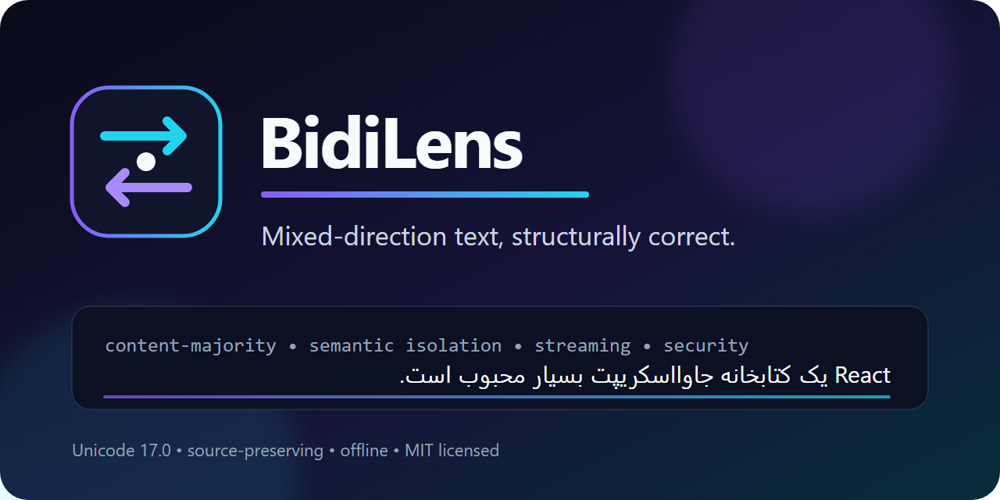
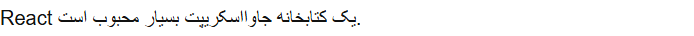
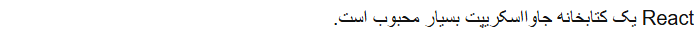

<p align="center">
  
</p>

# BidiLens

[](https://github.com/CodeinScrubs/BidiLens/actions/workflows/ci.yml)
[](LICENSE)
[](unicode/README.md)

[English README](README.md) · [امنیت](SECURITY.md) ·
[مشارکت](CONTRIBUTING.md) · [وضعیت پروژه](docs/V1_BUILD_REPORT.md)

> [!IMPORTANT]
> بخش وب و JavaScript یک نامزد انتشار آزموده‌شده است. کد منبع عمومی است، اما
> بسته‌های npm هنوز منتشر نشده‌اند و پلتفرم‌های بومی/دسکتاپ در نقشهٔ راه هستند.

BidiLens یک ابزار متن‌باز و آفلاین برای نمایش درست متن‌های ترکیبی راست‌به‌چپ
و چپ‌به‌راست در رابط‌های هوش مصنوعی، Markdown و برنامه‌های وب است.

این پروژه ترتیب منطقی متن را تغییر نمی‌دهد، رشته را برعکس نمی‌کند و جایگزین
الگوریتم دوجهتهٔ یونیکد نیست. BidiLens جهت پایهٔ هر بلوک را تعیین می‌کند،
بخش‌های فنی یا مخالف جهت را به‌صورت ساختاری جدا می‌کند و رندر نهایی را به
مرورگر یا موتور متن سیستم‌عامل می‌سپارد.

## مسئلهٔ اصلی

```text
React یک کتابخانه جاوااسکریپت بسیار محبوب است.
```

این جمله با `React` شروع می‌شود، اما محتوای طبیعی آن عمدتاً فارسی است؛ پس جهت
پایه باید RTL باشد. سیاست پیش‌فرض `content-majority` واژه‌های فنی مانند
`React`، نشانی وب، مسیر فایل، نسخه و دستور خط فرمان را از شواهد زبان طبیعی
کنار می‌گذارد و سپس جهت غالب را انتخاب می‌کند. خود `React` نیز به‌صورت LTR
ایزوله می‌شود تا علائم نگارشی اطراف را جابه‌جا نکند.

حالت معکوس نیز درست می‌ماند:

```text
The Persian word کتاب means “book”.
```

این جمله عمدتاً انگلیسی است؛ بنابراین جهت پایه LTR است و فقط واژهٔ فارسی
ایزوله می‌شود.

## چرا CSS سراسری کافی نیست؟

`direction: rtl` سراسری پیام‌های انگلیسی را خراب می‌کند و `dir="auto"` فقط
نخستین نویسهٔ قوی را می‌بیند؛ بنابراین شروع جمله با `React` جهت اشتباه LTR را
انتخاب می‌کند. برعکس‌کردن رشته نیز ترتیب کپی، جست‌وجو، لاگ، prompt و دسترس‌پذیری
را از بین می‌برد. BidiLens جهت هر بلوک را جداگانه محاسبه می‌کند، بخش‌های فنی
را با markup معنایی ایزوله می‌کند و رشتهٔ منطقی اصلی را بدون تغییر نگه می‌دارد.

| `dir="auto"` با جهت پایهٔ اشتباه | BidiLens با جهت RTL و ایزوله‌سازی |
|---|---|
|  |  |

## امکانات موجود

- دادهٔ قابل‌بازتولید و ثابت‌شدهٔ Unicode 17.0.0؛
- تحلیل جهت، شواهد، بازه‌ها و برنامهٔ ایزوله‌سازی؛
- پردازش جریان توکن با نتیجهٔ نهایی برابر با پردازش یک‌باره؛
- اسکن امنیتی نویسه‌های کنترل دوجهته و خروجی SARIF؛
- JSON Schema نسخه‌بندی‌شده برای تبادل تحلیل، امنیت و جریان میان زبان‌ها؛
- پشتیبانی HTML، DOM، unified/remark/rehype، markdown-it، React، Vue، Svelte و Web Component؛
- ابزارهای Playwright برای سنجش جهت، ایزوله‌سازی، انتخاب منطقی، کلیپ‌بورد و هندسه؛
- ابزار خط فرمان و حالت محافظه‌کارانه برای ترمینال؛
- GitHub Action مستقل برای ممیزی امنیتی و آزمون corpus در مخزن‌های دیگر؛
- ۹۱۸ نمونهٔ اعتبارسنجی‌شده با JSON Schema و آزمون تصویری در سه موتور مرورگر.

تمام بسته‌های عمومی ESM-only هستند و برای استفادهٔ سمت سرور به Node.js 22.12 یا
جدیدتر نیاز دارند. این بسته‌ها در این مخزن برای انتشار آماده شده‌اند، اما هنوز
از این نسخه در npm منتشر نشده‌اند.

پروژه با [مجوز MIT](LICENSE) متن‌باز است. شرایط داده‌های Unicode و بخش
Apache-2.0 پیکره در [THIRD_PARTY_NOTICES.md](THIRD_PARTY_NOTICES.md) حفظ شده
است. پرسش‌های ادغام را می‌توان در
[Discussions](https://github.com/CodeinScrubs/BidiLens/discussions) مطرح کرد و
گزارش امنیتی باید از مسیر
[Private Vulnerability Reporting](https://github.com/CodeinScrubs/BidiLens/security/advisories/new)
ارسال شود.

پس از انتشار کنترل‌شده در npm، حالت مستقل Web Component بدون ابزار build یا
import map نیز قابل استفاده است:

```html
<script type="module" src="https://unpkg.com/@bidilens/web-component@0.1.0"></script>
<bidi-message text="React یک کتابخانه جاوااسکریپت بسیار محبوب است."></bidi-message>
```

در برنامه‌هایی که bundler دارند، ورودی عادی بسته بهتر است؛ چون bundler
می‌تواند `@bidilens/core` را میان وابستگی‌ها تکرارزدایی کند.

## توسعه و بررسی

```bash
corepack enable
pnpm install --frozen-lockfile
pnpm run check
pnpm run test:visual
pnpm run release:check
```

## محدودیت‌های صریح

نسخهٔ فعلی بسته‌های وب و TypeScript را پیاده‌سازی می‌کند. Android، Flutter،
React Native، SwiftUI، Electron، افزونهٔ VS Code، PDF و آزمون آزمایشگاهی
صفحه‌خوان‌ها هنوز ارائه نشده‌اند. مالکیت scope در npm، تنظیم provenance و
مجوزهای انتشار بسته نیز باید پیش از انتشار npm توسط نگه‌دارنده تکمیل شود.

برای جزئیات به `docs/ARCHITECTURE.md`، `docs/LIMITATIONS.md`،
`docs/PUBLISHING.md`، `docs/ROADMAP.md` و ممیزی کامل نیازمندی‌ها در
`docs/REQUIREMENT_MATRIX.md` مراجعه کنید.
