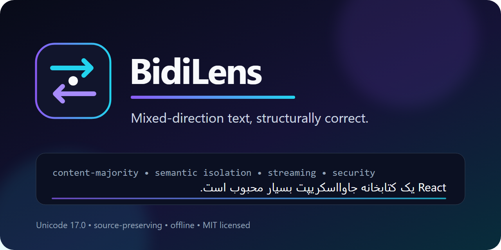
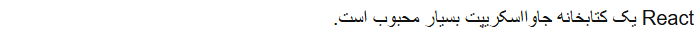

<p align="center">
  
</p>

# BidiLens

[](https://github.com/CodeinScrubs/BidiLens/actions/workflows/ci.yml)
[](https://www.npmjs.com/package/@bidilens/core)
[](LICENSE)
[](unicode/README.md)

[English README](README.md) · [امنیت](SECURITY.md) ·
[مشارکت](CONTRIBUTING.md) · [وضعیت پروژه](docs/V1_BUILD_REPORT.md)

> [!IMPORTANT]
> بخش وب و JavaScript به‌عنوان نسخهٔ آزمایشی عمومی `0.3.0` منتشر شده است. هر
> ۱۲ بستهٔ `@bidilens/*` در npm عمومی هستند و یکپارچگی و provenance آن‌ها
> بررسی شده است. نسخهٔ `0.1.1` هستهٔ Kotlin و ماژول‌های Android Views و
> Jetpack Compose نیز امضاشده و در Maven Central عمومی است؛ برنامهٔ نمونه و
> شواهد انتشار در
> [`android-v0.1.1`](https://github.com/CodeinScrubs/BidiLens/releases/tag/android-v0.1.1)
> قرار دارند.

BidiLens یک ابزار متن‌باز و آفلاین برای نمایش درست متن‌های ترکیبی راست‌به‌چپ
و چپ‌به‌راست در رابط‌های هوش مصنوعی، Markdown، برنامه‌های وب و Android است.

این پروژه ترتیب منطقی متن را تغییر نمی‌دهد، رشته را برعکس نمی‌کند و جایگزین
الگوریتم دوجهتهٔ یونیکد نیست. BidiLens جهت پایهٔ هر بلوک را تعیین می‌کند،
بخش‌های فنی یا مخالف جهت را به‌صورت ساختاری جدا می‌کند و رندر نهایی را به
مرورگر یا موتور متن سیستم‌عامل می‌سپارد.

## مسئلهٔ اصلی

```text
React یک کتابخانه جاوااسکریپت بسیار محبوب است.
```

این جمله با `React` شروع می‌شود، اما محتوای طبیعی آن عمدتاً فارسی است؛ پس جهت
پایه باید RTL باشد. سیاست پیش‌فرض `content-majority` واژه‌های فنی مانند
`React`، نشانی وب، مسیر فایل، نسخه و دستور خط فرمان را از شواهد زبان طبیعی
کنار می‌گذارد و سپس جهت غالب را انتخاب می‌کند. خود `React` نیز به‌صورت LTR
ایزوله می‌شود تا علائم نگارشی اطراف را جابه‌جا نکند.

حالت معکوس نیز درست می‌ماند:

```text
The Persian word کتاب means “book”.
```

این جمله عمدتاً انگلیسی است؛ بنابراین جهت پایه LTR است و فقط واژهٔ فارسی
ایزوله می‌شود.

## چرا CSS سراسری کافی نیست؟

`direction: rtl` سراسری پیام‌های انگلیسی را خراب می‌کند و `dir="auto"` فقط
نخستین نویسهٔ قوی را می‌بیند؛ بنابراین شروع جمله با `React` جهت اشتباه LTR را
انتخاب می‌کند. برعکس‌کردن رشته نیز ترتیب کپی، جست‌وجو، لاگ، prompt و دسترس‌پذیری
را از بین می‌برد. BidiLens جهت هر بلوک را جداگانه محاسبه می‌کند، بخش‌های فنی
را با markup معنایی ایزوله می‌کند و رشتهٔ منطقی اصلی را بدون تغییر نگه می‌دارد.

| `dir="auto"` با جهت پایهٔ اشتباه | BidiLens با جهت RTL و ایزوله‌سازی |
|---|---|
|  |  |

## امکانات موجود

- دادهٔ قابل‌بازتولید و ثابت‌شدهٔ Unicode 17.0.0؛
- تحلیل جهت، شواهد، بازه‌ها و برنامهٔ ایزوله‌سازی؛
- پردازش جریان توکن با نتیجهٔ نهایی برابر با پردازش یک‌باره؛
- جریان غنی Markdown-It با AST، HTML، ایزوله‌سازی و گزارش امنیتی نهاییِ برابر با پردازش یک‌باره؛
- اسکن امنیتی نویسه‌های کنترل دوجهته و خروجی SARIF؛
- JSON Schema نسخه‌بندی‌شده برای تبادل تحلیل، امنیت و جریان میان زبان‌ها؛
- پشتیبانی HTML، DOM، unified/remark/rehype، markdown-it، React، Vue، Svelte و Web Component؛
- ابزارهای Playwright برای سنجش جهت، ایزوله‌سازی، انتخاب منطقی، کلیپ‌بورد و هندسه؛
- ابزار خط فرمان و حالت محافظه‌کارانه برای ترمینال؛
- GitHub Action مستقل برای ممیزی امنیتی و آزمون corpus در مخزن‌های دیگر؛
- ۹۱۸ نمونهٔ اعتبارسنجی‌شده با JSON Schema و آزمون تصویری در سه موتور مرورگر؛
- هستهٔ Kotlin، اتصال بدون تغییر متن برای `TextView` و `EditText`، اجزای
  نمایشی و ویرایشی Compose، برنامهٔ نمونه، lint، ساخت AAR/APK و آزمون واقعی
  رابط کاربری روی Android 15 و 16.
- بستهٔ Swift با نمای خواندنی `BidiText` برای SwiftUI و اتصال‌های UIKit،
  جداسازی جهت پاراگراف از ترازبندی فیزیکی و آزمون‌های شبیه‌ساز iOS.

راهنمای نصب از source، تنظیم `android:supportsRtl="true"` و نمونه‌کدهای
Compose و Views در [راهنمای Android](android/README.md) قرار دارد.

تمام بسته‌های عمومی ESM-only هستند و برای استفادهٔ سمت سرور به Node.js 22.12 یا
جدیدتر نیاز دارند. مجموعهٔ کامل نسخهٔ `0.3.0` در
[سازمان `@bidilens` در npm](https://www.npmjs.com/org/bidilens) منتشر شده است.

پروژه با [مجوز MIT](LICENSE) متن‌باز است. شرایط داده‌های Unicode و بخش
Apache-2.0 پیکره در [THIRD_PARTY_NOTICES.md](THIRD_PARTY_NOTICES.md) حفظ شده
است. پرسش‌های ادغام را می‌توان در
[Discussions](https://github.com/CodeinScrubs/BidiLens/discussions) مطرح کرد و
گزارش امنیتی باید از مسیر
[Private Vulnerability Reporting](https://github.com/CodeinScrubs/BidiLens/security/advisories/new)
ارسال شود.

حالت مستقل Web Component منتشرشده بدون ابزار build یا import map نیز قابل
استفاده است:

```html
<script type="module" src="https://unpkg.com/@bidilens/web-component@0.3.0"></script>
<bidi-message text="React یک کتابخانه جاوااسکریپت بسیار محبوب است."></bidi-message>
```

در برنامه‌هایی که bundler دارند، ورودی عادی بسته بهتر است؛ چون bundler
می‌تواند `@bidilens/core` را میان وابستگی‌ها تکرارزدایی کند.

ورودی اصلی Web Component عمداً بدون عارضهٔ جانبی است. در پروژه‌های دارای
bundler، عنصر را صریح ثبت کنید:

```js
import { defineBidiMessageElement } from '@bidilens/web-component';

defineBidiMessageElement();
```

اگر ثبت خودکار را ترجیح می‌دهید، ورودی زیر را وارد کنید:

```js
import '@bidilens/web-component/auto';
```

## توسعه و بررسی

```bash
npm install --global corepack@0.34.1
corepack enable
pnpm install --frozen-lockfile
pnpm run check
pnpm run test:visual
pnpm run release:check

# با JDK 21 و Android SDK
pnpm run android:check
```

## محدودیت‌های صریح

نسخهٔ فعلی بسته‌های وب و TypeScript و پیاده‌سازی بومی Android را دارد.
نسخهٔ `0.1.1` Android به‌صورت امضاشده در Maven Central منتشر شده و روی
شبیه‌ساز آزموده شده است؛ آزمون دستگاه‌های فیزیکی OEM، صفحه‌کلیدهای مختلف،
TalkBack و پایلوت محصول واقعی هنوز باقی مانده‌اند.
Flutter، React Native، SwiftUI ویرایشی، Electron، افزونهٔ VS Code، PDF و آزمون
آزمایشگاهی صفحه‌خوان‌ها هنوز ارائه نشده‌اند. مالکیت scope در npm، یکپارچگی
بسته‌ها و provenance بررسی شده‌اند؛ ممیزی مستقل و شواهد استفاده در محصول
واقعی هنوز باقی مانده‌اند.

در جریان غنی Markdown، وضعیت جهت با هر `push()` به‌روز است؛ اما AST و HTML در
نقاط کنترل هندسی به‌روز می‌شوند. `pendingSourceRange` بخش هنوز پردازش‌نشده را
مشخص می‌کند و `finish()` مرز برابری دقیق با پردازش یک‌باره است.

برای جزئیات به `docs/ARCHITECTURE.md`، `docs/LIMITATIONS.md`،
`docs/PUBLISHING.md`، `docs/ROADMAP.md` و ممیزی کامل نیازمندی‌ها در
`docs/REQUIREMENT_MATRIX.md` مراجعه کنید.
