# Mixed-direction problem gallery

Persian, Arabic, Hebrew, and Latin text share one logical string, but they do
not share one reading direction. A leading product name, an English quote,
or a code path can make one global direction setting inadequate. These cases
show what BidiLens supplies: paragraph policy and inline isolation, with the
source string and the developer's alignment preserved.

The paired images below are **real Chromium captures of reproducible fixtures**
rendered by the current, unreleased source checkout. They are not edited
screenshots or proof of deployment inside ChatGPT or another application.
Every pair uses the same source, font, width, and styling. Each folder includes
the source, both rendered HTML files, and machine-readable observations and
SHA-256 hashes. [index.json](index.json) records the capture environment and
source hashes. Published versions and native platforms can have different
behavior; see the [production review](../PRODUCTION_READINESS.md).

## Before and after

| Problem and intended behavior | Before | BidiLens |
| --- | --- | --- |
| [Latin first word in Persian prose](persian-leading-identifier/source.txt): `dir="auto"` picks LTR; the intended paragraph base is RTL. | 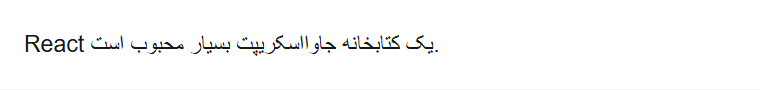 | 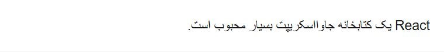 |
| [Physical left alignment](persian-aligned-left/source.txt): the paragraph stays on the left while retaining RTL reading order. |  |  |
| [English inside an RTL host](english-in-rtl-host/source.txt): English prose needs an LTR base and the Persian word needs isolation. | 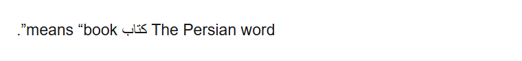 |  |
| [Independent paragraphs](independent-paragraphs/source.txt): an English paragraph and a Persian paragraph need different bases. | 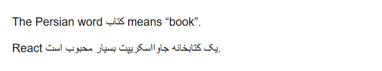 | 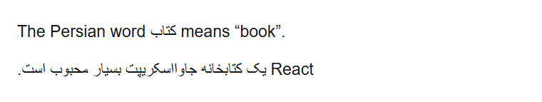 |
| [Domain-specific technical phrase](technical-phrase/source.txt): the host declares its domain terms as identifiers so the surrounding Persian prose supplies the base. | 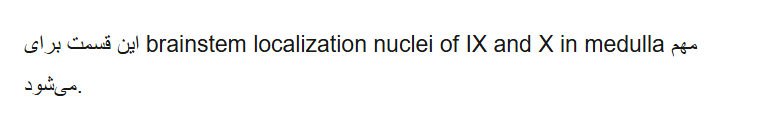 | 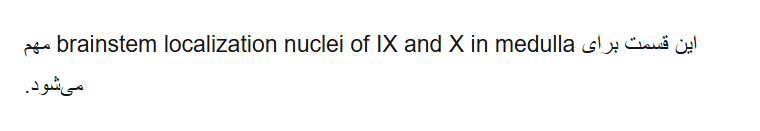 |
| [Mixed Markdown](mixed-markdown/source.txt): headings, lists, quotes, cells, and code need their own boundaries. | 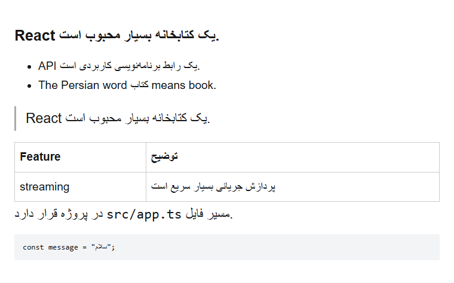 | 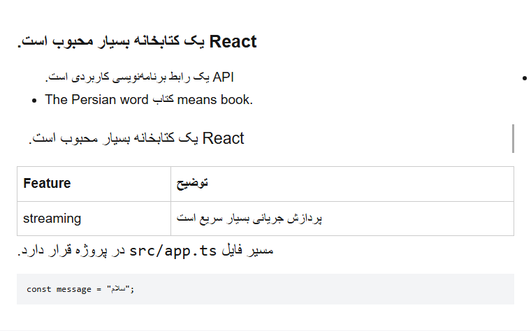 |
| [Mobile study prose](mobile-medical-markdown/source.txt): English-leading Persian paragraphs, multiword terms and English formulas need independent bases at 390 px. | 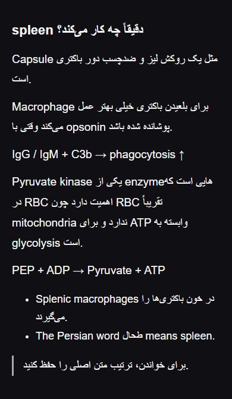 | 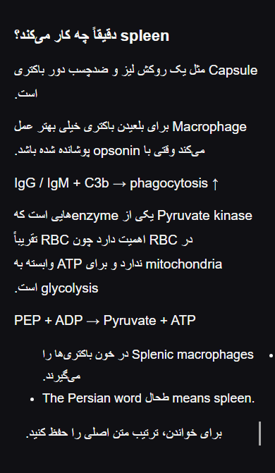 |
| [Mobile query literals](mobile-query-literals/source.txt): code boundaries must preserve backslashes and bracket syntax inside Persian prose. | 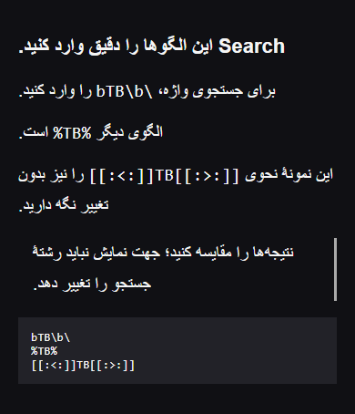 | 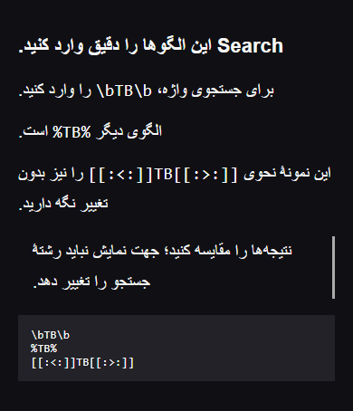 |
| [Explicit author intent](mobile-explicit-intent/source.txt): a domain-heavy Persian sentence has more Latin letters; its intended base cannot be inferred reliably. | 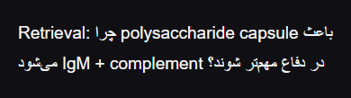 | 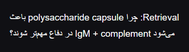 |

Content majority is a heuristic, not a language or intent detector. In the
technical-phrase case, the gallery explicitly passes `technicalIdentifiers`;
[its evidence](technical-phrase/evidence.json) records that choice. For known
language or author intent, an explicit direction may be simpler and more
reliable. Native `dir="auto"` and `<bdi>` are sufficient for many other cases;
see [native HTML or BidiLens](../NATIVE_OR_BIDILENS.md).

The three mobile cases are **curated logical reconstructions inspired by five
captures supplied on October 2, 2026**, not verbatim recovered ChatGPT messages.
Their original images remain in the private local `incoming/2026-10-02/` inbox;
account/chat UI is not published here. Each mobile case's evidence records its
390 px viewport. The explicit-intent case passes `strategy: 'rtl'` for that
single known-Persian paragraph; it does not force an entire multilingual chat RTL.
[The engineering brief](../MIXED_DIRECTION_ENGINEERING_BRIEF.md) explains the
policy and a bounded downstream pilot.

## Problems encountered in an actual application

The user supplied these ChatGPT captures during ordinary use. They contain
mixed Persian/English study text, abbreviations, lists, arrows, and Markdown.
They illustrate encountered rendering symptoms; they do not provide the
original logical text, application version, DOM, or a measured incidence rate.
Their medical wording is rendering material, not clinical guidance.

- [Mixed heading and technical phrase](originals/chatgpt-heading.png)
- [A second capture of the same passage](originals/chatgpt-heading-context.png)
- [Table, arrows, quotations, and abbreviations](originals/chatgpt-table-quotes.png)
- [Lists and mixed technical labels](originals/chatgpt-lists.png)

[Original capture hashes](originals/manifest.json) preserve provenance.
[Screenshot-derived regression material](../SCREENSHOT_CASES.md) explains the
transcription limits. A visual screenshot cannot establish the original
logical word order: if the model generated incorrect grammar or word order,
BidiLens cannot repair that by adjusting direction.

No matching capture from a modified ChatGPT client is claimed. The paired
fixtures above demonstrate the actual toolkit under controlled conditions;
host-specific before/after pairs should be added when an integration is
implemented and tested.

## Reproduce and contribute a case

From the repository root, install the pinned dependencies and browser, then:

```bash
pnpm install --frozen-lockfile
pnpm exec playwright install chromium
pnpm run gallery:generate
pnpm run gallery:check
```

The generator runs the real HTML and Markdown adapters and checks source
preservation, paragraph direction, physical alignment, isolation structure,
and logical DOM ranges before writing images. Captures vary with the OS,
font fallback, and browser version; do not treat pixel differences as proof
of a semantic regression.

To submit an encountered case, use the [case template](CASE_TEMPLATE.md).
Include exact logical source when available, intended direction and alignment,
runtime/OS/font information, reproduction steps, and the tested adapter/version.
Keep original and fixed images visibly labeled. Remove private messages,
account details, tokens, and patient data before publication. Screenshots of
third-party interfaces remain illustrative material with their respective
owners' marks; they do not imply endorsement.

The local mirror is `problem-gallery/` under the user's outer workspace.
Its `incoming/` folder is for private candidate captures. Only reviewed cases
belong in this public repository directory.
